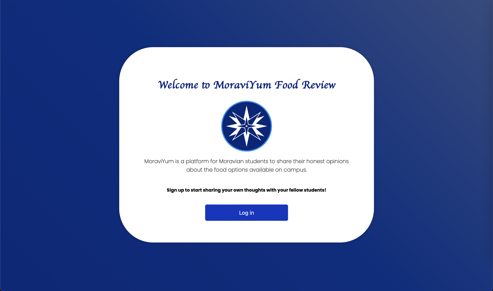
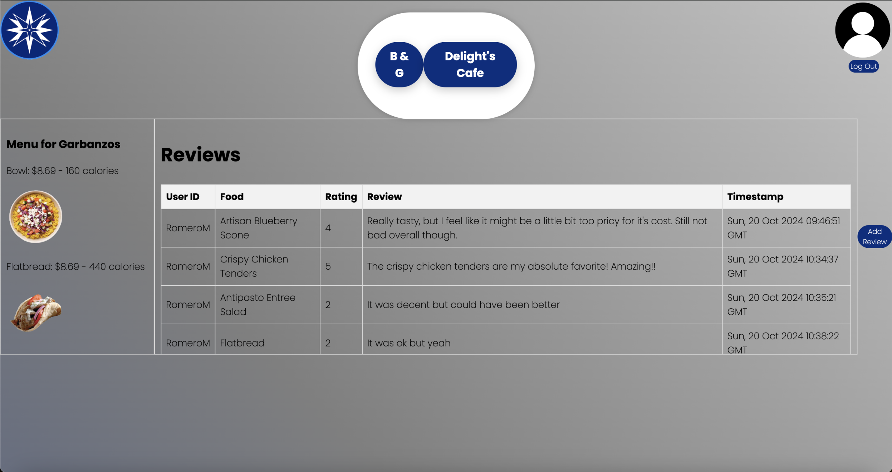

# MoraviYum Food Review Website

An online web application designed for Moravian University students to help each other out by sharing their thoughts and opinions on the various foods provided on campus!

Project designed for *CSCI 399: Cloud Computing*

## Contributers
- [Christine Colvin](https://github.com/christinecolvin)
- [Jack Drabic](https://github.com/JackJack7890)
- [Rafael Garcia Jr.](https://github.com/RGJ-713)
- [Michael Romero](https://github.com/MichaelRomero1)

## MoraviYum Architecture


## How It Works

Moravian students are greeted to a homepage where they can log in with their university email accounts.



Once logged in, the user can then select one of two dining locations from the Moravian campus, "The B&G Cafe" or "DeLight's Cafe". They can select these locations and be presented a list of various food vendors from that location.

Once a vendor is selected, they can then select the food they want to leave a review and leave a rating from 1-5.



### 2. Dependencies 
There are multiple ways to install any dependencies that are not installed on your system.
- You can use this command in your terminal with the blank replacing the dependency not in access: 
```
pip install ___
```
- You can create a virtual environment with these commands going into your terminal:
```
python3 -m venv .venv
source .venv/bin/activate
pip install -r requirements.txt
```  

# AWS EC2 Instance Installation Tutorial

### 1. Create a new EC2 instance
If you haven't already, create a new EC2 instance on [Amazon Web Services](https://aws.amazon.com/?nc2=h_lg).

Once created, `ssh` into the instance in a [Command Line Interface](https://en.wikipedia.org/wiki/Command-line_interface#:~:text=A%20command%2Dline%20interface%20\(CLI,interface%20available%20with%20punched%20cards.) with the following command:

```
ssh -i ~/.ssh/labsuser.pem ec2-user@<PUBLIC IPv4 ADDRESS HERE>
```

### 2. Clone the repo
Once you are all set up, install `git` in the EC2 instance with the following command:

```
sudo yum install -y git
```

Afterwards, press the green **<> Code** button to gain a link to clone the repository.

Then, in your Command Line Interface, clone the repository with the following command:

```
git clone https://github.com/cs399f24/MoraviYum_WebApp.git
```

### 3. Run `__`
Now, enter the **`moraviyum_WebApp`** repository in the EC2 instance.

Run the following command:

```
___
```

Follow the instruction prompts given in the terminal. This will complete all the necessary set-up for the bot to run.

### 4. Run the bot
The bot should now successfully be up and running on the EC2 instance!

