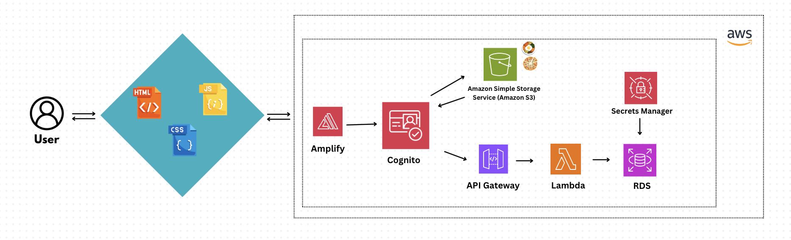

# MoraviYum Food Review Web App

An online web application designed for Moravian University students to help each other out by sharing their thoughts and opinions on the various foods provided on campus!

Project designed for *CSCI 399: Cloud Computing.*

## Contributers
- [Christine Colvin](https://github.com/christinecolvin)
- [Jack Drabic](https://github.com/JackJack7890)
- [Rafael Garcia Jr.](https://github.com/RGJ-713)
- [Michael Romero](https://github.com/MichaelRomero1)

## MoraviYum Architecture


## How It Works

Moravian students are greeted to a homepage where they can log in with their university email accounts.


Once logged in, the user can then select one of two dining locations from the Moravian campus, "The B&G Cafe" or "DeLight's Cafe". They can select these locations and be presented a list of various food vendors from that location.

Once a vendor is selected, they can then select the food they want to leave a review and leave a rating from 1-5.


# Tutorial - Deploy The App on Amazon Web Services (AWS)

### Step 1. Create a Cloud9 environment
First, open up the [AWS Cloud9](https://us-east-1.console.aws.amazon.com/cloud9control/home?region=us-east-1#/) IDE and create a new Cloud9 environment by clicking the orange **`Create environment`** button.

Once you've given it a name, scroll down to the **`Network settings`** section at the bottom of the page and select **`Secure Shell (SSH)`**.

Once done, click the orange **`Create`** button to create the environment.

### Step 2. Clone the repo
Once you are all set up and have entered your Cloud9 environment, press the green **<> Code** button to gain a link to clone the repository.

Then, clone the repository with the following command:

```
git clone https://github.com/cs399f24/MoraviYum_WebApp.git
```

Once cloned, enter the **`MoraviYum_WebApp`** repository with the following command:

```
cd MoraviYum_WebApp
```

Finally, create a virtual environment and install the app dependencies with the following commands:

```
python3 -m venv .venv
source .venv/bin/activate
pip install -r requirements.txt
```

### Step 3. Build app resources
You will now build key resources that the app will use. Before doing so, be sure to create the following credentials in a **`.env`** file in both the **`MoraviYum_WebApp`** and **`scripts`** directories:

```
S3_BUCKET_NAME='<FILL-IN-HERE>'
RDS_USERNAME='<FILL-IN-HERE>'
RDS_PASSWORD='<FILL-IN-HERE>'
RDS_DB_NAME='moraviyum_database'
```

*Note that the `S3_BUCKET_NAME` credential must be universally unique across all AWS accounts.*

Once the credentials have been entered, enter the **`scripts`** repository with the following command:

```
cd scripts
```

Once in the repository, run the following commands to build and populate an RDS database and Amazon S3 bucket for the application:

```
sh build_resources.sh
sh populate_rds.sh
```

*Note: You may need to wait for the database creation to be completed.*

If successful, the RDS and S3 instances should have been created. If so, go to [Amazon S3](https://us-east-1.console.aws.amazon.com/s3/buckets?region=us-east-1&bucketType=general) and select the name of the newly created bucket.

Once selected, look for and click on the **`Permissions`** tab at the top of the screen. Scroll down to the **`Bucket policy`** section and click the blue **`Edit`** button.

Copy and paste the following bucket policy into the **`Policy`** text field to allow the bucket images to be visible once the web app is created. Be sure to replace `<YOUR-BUCKET-NAME>` with the unique name of your previously created bucket:

```
{
    "Version": "2012-10-17",
    "Statement": [
        {
            "Effect": "Allow",
            "Principal": "*",
            "Action": "s3:GetObject",
            "Resource": "arn:aws:s3:::<YOUR-BUCKET-NAME>/*"
        },
        {
            "Sid": "AllowAmplifyToListPrefix_d2mmvspb72pkyr_staging_",
            "Effect": "Allow",
            "Principal": {
                "Service": "amplify.amazonaws.com"
            },
            "Action": "s3:ListBucket",
            "Resource": "arn:aws:s3:::<YOUR-BUCKET-NAME>",
            "Condition": {
                "StringEquals": {
                    "s3:prefix": "",
                    "aws:SourceArn": "arn%3Aaws%3Aamplify%3Aus-east-1%3A081836815375%3Aapps%2Fd2mmvspb72pkyr%2Fbranches%2Fstaging",
                    "aws:SourceAccount": "081836815375"
                }
            }
        },
        {
            "Sid": "AllowAmplifyToReadPrefix_d2mmvspb72pkyr_staging_",
            "Effect": "Allow",
            "Principal": {
                "Service": "amplify.amazonaws.com"
            },
            "Action": "s3:GetObject",
            "Resource": "arn:aws:s3:::<YOUR-BUCKET-NAME>/*",
            "Condition": {
                "StringEquals": {
                    "aws:SourceArn": "arn%3Aaws%3Aamplify%3Aus-east-1%3A081836815375%3Aapps%2Fd2mmvspb72pkyr%2Fbranches%2Fstaging",
                    "aws:SourceAccount": "081836815375"
                }
            }
        },
        {
            "Effect": "Deny",
            "Principal": "*",
            "Action": "s3:*",
            "Resource": "arn:aws:s3:::<YOUR-BUCKET-NAME>/*",
            "Condition": {
                "Bool": {
                    "aws:SecureTransport": "false"
                }
            }
        }
    ]
}
```

Press the orange **`Save changes`** button at the bottom of the page to save the new bucket policy.

### Step 4. Preparing initial deployment
You will now prepare to deploy the app for the first time.

First, run the following command while in the **`scripts`** directory to ensure certain `create` scripts will be properly executed:

```
chmod +x ./create_*
```

In addition, run the following commands in the terminal to ensure the AWS Amplify app gets created and deployed properly. Replace each `<FILL-IN-HERE>` with their respective credential by click on **`AWS Details`** in the Learner Lab and the grey **`Show`** button next to **`AWS CLI`**:

```
unset AWS_ACCESS_KEY_ID
unset AWS_SECRET_ACCESS_KEY
unset AWS_SESSION_TOKEN
unset AWS_DEFAULT_REGION
export AWS_ACCESS_KEY_ID=<FILL-IN-HERE>
export AWS_SECRET_ACCESS_KEY=<FILL-IN-HERE>
export AWS_SESSION_TOKEN=<FILL-IN-HERE>
export AWS_DEFAULT_REGION=<FILL-IN-HERE>
```

Now open the **`.env`** in the **`scripts`** directory and add the following credentials:

```
USER_EMAIL='<FILL-IN-HERE>'
NEW_USERNAME='<FILL-IN-HERE>'
TEMP_PASS='<FILL-IN-HERE>'
```

Finally, locate the **`scripts/create_cognito.py`** file and locate **`lines 75-81`**, replacing `<UNIQUE-COGNITO-DOMAIN-HERE>` with a universally unique domain name (i.e: `moraviyum-domain-name`) and be sure to save the file:

```
# Configure a domain for the hosted UI
cognito_client.create_user_pool_domain(

    Domain='<UNIQUE-COGNITO-DOMAIN-HERE>',
    UserPoolId=user_pool_id
)
print("Hosted UI domain configured")
```

### Step 5. Initially deploy the app
Now, run the following command to initially deploy the app:

```
sh initial_deploy.sh
```

*Note: Be patient, as this may take a while.*

### Step 6. Additional configuration for now-deployed app
The app should now be successfully deployed! Now, a few more small changes need to be made in order for the web app to fully connect to each resource.

First, go to [AWS Amplify](https://us-east-1.console.aws.amazon.com/amplify/apps) and select the newly created **`MoraviYumApp`**.

Press the purple **`Deploy updates`** button, and select **`Amazon S3`** under the **`Methods`** section. Select the purple **`Browse S3`**, and choose your previously created S3 bucket. Finally, hit the purple **`Save and deploy`** button.

Now, access the deployed app and press the blue **`Login`** button.

Locate the **`templates/index.html`** file in Cloud9 and copy the full link address of the Cognito sign-in page you were taken to on the web app. Modify **`lines 17 and 24`** of the **`index.html`** file and replace `<UNIQUE-COGNITO-DOMAIN-HERE>` with the link you just copied. Be sure to save the file, afterwards:

```
<a href="<UNIQUE-COGNITO-DOMAIN-NAME>">
const login_server = '<UNIQUE-COGNITO-DOMAIN-NAME>'
```

You will do something similar for the **`templates/review.html`** file. Locate **`line 53`**, and replace `<API-GATEWAY-INVOKE-URL>` with the Invoke URL obtained from [API Gateway](https://us-east-1.console.aws.amazon.com/apigateway/main/apis?api=unselected&region=us-east-1):

```
const server = '<API-GATEWAY-INVOKE-URL>';
```

Once modified, run the following commands in the Cloud9 terminal to copy the newly editted files to your S3 bucket (this is assuming you are still in the **`scripts`** directory:

```
aws s3 cp ../templates/index.html s3://<BUCKET-NAME>/
aws s3 cp ../templates/review.html s3://<BUCKET-NAME>/
```

Back on API Gateway, locate and click the **`submit_review`** resource under the **`Resources`** section. Press the blue **`Enable CORS`** button at the top of the screen.

Check each box on the initial setting and modify the **`Access-Control-Allow-Headers`** field to only read `Content-Type`. Press the orange **`Save`** button to save your changes. Be sure to press the orange **`Deploy API`** button on the screen afterwards.

Once all has been done, deploy the changes on Amplify by following the first few tasks described during this step.

### Step 7. Enjoy!
At this point, the app should be fully and successfully deployed!

# Additional Info

### `.env` file
Certain scripts add to a `.env` file that hold your credentials. Should you feel the need to edit this manually, the `.env` must contain the following:
```
RDS_USERNAME='<FILL-IN-HERE>'
RDS_PASSWORD='<FILL-IN-HERE>'
RDS_DB_NAME='moraviyum_database'
S3_BUCKET_NAME='<FILL-IN-HERE>'
AMPLIFY_DOMAIN='<FILL-IN-HERE>'
API_GATEWAYURL='<FILL-IN-HERE>'
USER_EMAIL='<FILL-IN-HERE>'
NEW_USERNAME='<FILL-IN-HERE>'
TEMP_PASS='<FILL-IN-HERE>'
```

### Undeploy/redeploy scripts
In the **`scripts`** directory exist scripts to undeploy and redploy the Amplify app without destroying the other resources needed for the app. Should you feel the need to use them, while in the directory, run the following commands:

```
bash undeploy_amplify.sh
bash redeploy.sh
```
